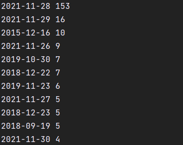
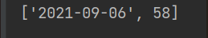

# XML
Результаты в файлах news.json и full_news.json
#API

Большое количество правок приходится на день смерти Градского.

Такой метрикой нельзя пользоваться, потому что данные обновляются очень часто и это может
привести к ошибочным результатам.
